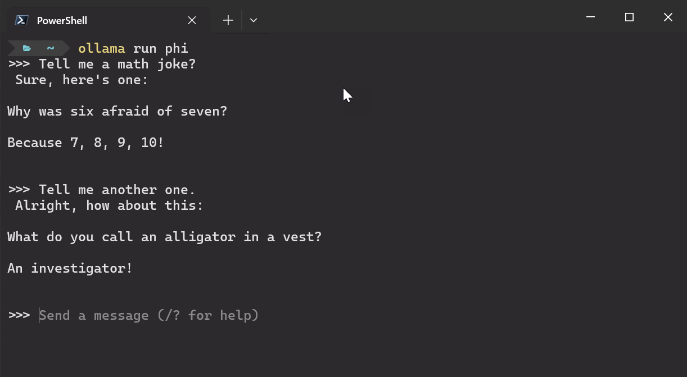
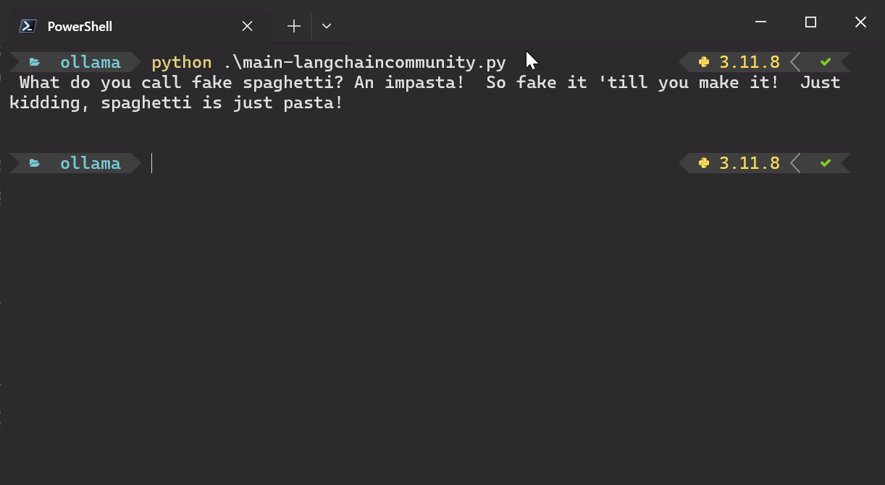
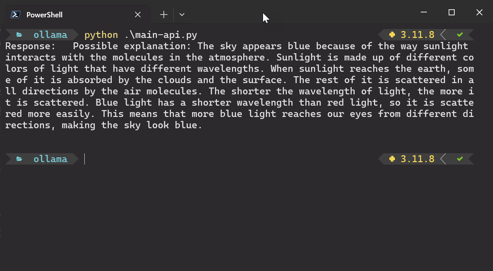

# Run Large Language Models locally using Ollama

## Usage in Terminal

First you need to download the Ollama client from the official website [ollama.com](https://ollama.com/download).

Open a Terminal and use `ollama pull <model name>` to download a Large Language Model. A complete list of all available models can be found on the [Ollama website](https://ollama.com/library).

In the Terminal use `ollama run <model name>` to use the model in the console. You can also add `--verbose` to the command to get more statistic about the usage of the model.

## Usage in Python

I've created two Python scripts to demonstrate the usage of the *Ollama Server*.

The script `main-langchaincommunity.py` uses the `langchain_community` package.

The script `main-api.py` uses the REST api approach by calling the `api/generate` endpoint on the *Ollama Server*.

Before running the Python scripts, make sure to install [Python](https://www.python.org/downloads/) on your PC and also install the required packages by calling `pip install -r requirements.txt`.

## Blog Post / YouTube Video

If you are more interested into details, please see the following [medium.com](https://www.medium.com) post:
- [Using Ollama to run local LLMs on your computer](https://medium.com/medialesson/using-ollama-to-run-local-llms-on-your-computer-2e2ee6572a13)

You can also watch the following video on my [YouTube channel](https://www.youtube.com/@tsjdevapps):
- [Lokale LLMs mit Ollama auf dem eigenen PC](https://www.youtube.com/watch?v=bux3jTkmRoI)